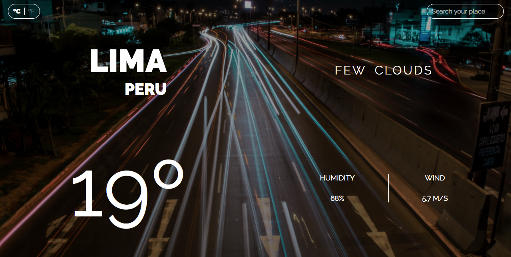

# The App of the Weather - JS App

> I developed a Weather application on my own in which I had the chance to consolidate my knowledge about JS Promises, Asynchronous tasks, working with APIS, and using Webpack as a module manager. The application will automatically detect your city and display its current weather time. You can also search for any other city in the world using the search bar in the top right section. Furthermore, you can select the unit of the degree in which you want to get the temperature (ºC or ºF).

## Built With

- JS
- HTML
- SASS

## Tools

- Webpack
- npm

## Apis consumed
- OpenWeatherApi
- UnsplashApi

## NPM available scripts
Use "npm run-script " followed by any of the following commands : 

- "build": "webpack --mode production"
- "watch": "webpack --mode development --watch"

## Live Demo

[Live Demo Version](https://rawcdn.githack.com/xtrmdarc/weather-app/8ad493eef7012ab03688cb6d512e7db52030ce4d/dist/index.html)

## Preview

## Future Work

- Share weather update on social media buttons
- Schedule weather alert based on forecast
- Build the backend infrastructure
- Create user accounts

## Authors

👤 **Diego Antonio Reyes Coronado**

- Github: [@xtrmdarc](https://github.com/xtrmdarc)
- Twitter: [@diegoreyesco](https://twitter.com/DiegoAn91629127)
- Linkedin: [diegoreyesco](https://www.linkedin.com/in/diego-reyes-coronado)

## 🤝 Contributing

Contributions, issues and feature requests are welcome!

Feel free to check the [issues page](https://github.com/bren2102/To-do-list/issues).

## Show your support

Give a ⭐️ if you like this project!
